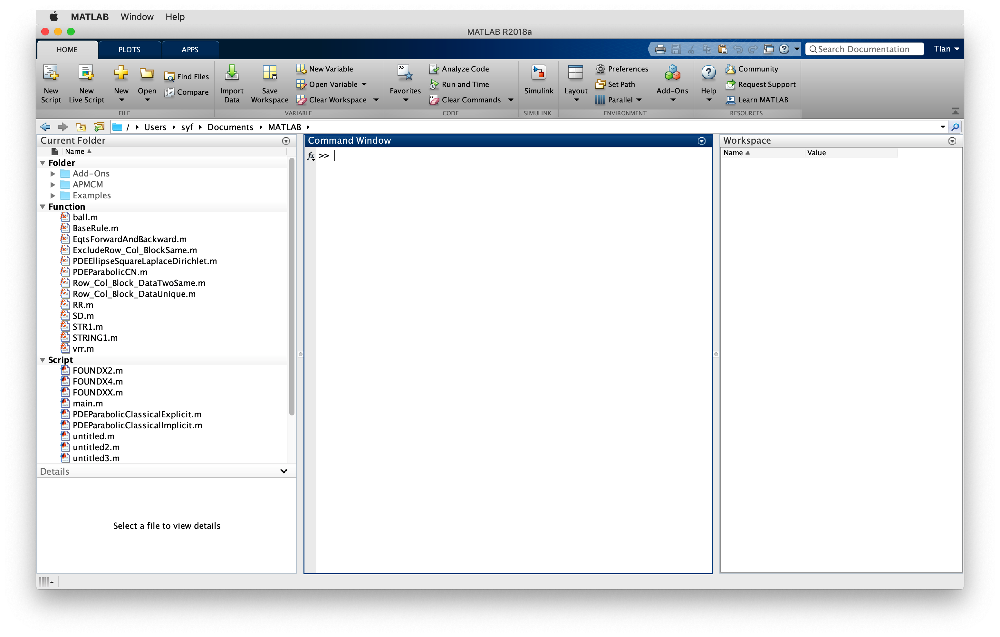

# 用户界面

在安装完毕后, 打开MATLAB, 这里以MATLAB_R2018a(Mac os)示例

整个界面大致可以划分为四块（由于每一块都是可以通过鼠标拖动进行布局调整的，可能会存在差异）

* 工具栏（上方）
* 当前文件夹预览窗口（左侧）
* 命令行（中间）
* 工作区（右侧）

**工具栏**
工具栏有多个选项卡，在使用一些功能时，还会出现临时的功能选项卡。
在现有的选项卡中，

* `HOME`包含*新建脚本文件*、*导入数据*、*偏好设置*、*路径设置*等最常用的功能与设置选项。
* `PLOTS`是画图功能选项卡，里面可以预览所有支持的画图类型。在选中工作区的一个或多个变量是，`PLOTS`显示的选项会变为适用于当前选中的变量的图像，用于快速创建图像。
* `APPS`包含众多的应用，涉及从简单的拟合到复杂的机器学习、机械仿真、图像处理等，不同领域的应用有做简单分类。`APPS`将代码形式的工具箱（TOOLBOX）集成为可视化的应用程序，极大的减少了使用者的学习成本。
  _*由于APPS更新比较频繁，且操作简单，每一步操作都会有提示，本篇不做过多介绍*_

**当前文件夹预览窗口**
当打开一个文件夹后，会在预览窗口显示这个文件夹的所有文件和子文件夹。 _*初次打开时，当前文件夹应当为MATLAB程序所在的 `bin` 文件夹，为避免误删影响程序运行的重要文件，应当在其他位置新建文件夹，并修改当前文件夹为该新建的文件夹*_